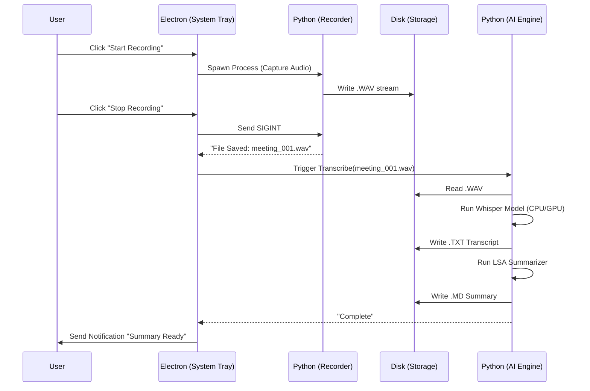

# System Design & Data Flow

This document outlines the technical architecture of the Meeting Assistant without exposing specific implementation details.

## Data Flow Diagram

## Technical Challenges & Solutions

### 1. Python Distribution in Electron
**Challenge**: Distributing a heavy Python environment with dependencies (Torch, NumPy) to end-users who might not have Python installed.
**Solution**: The application uses a bundled virtual environment (or PyInstaller executable in production) that is spawned by Electron using `child_process.spawn`. We manage `std/out` and `std/err` to bridge the gap between the Node.js event loop and Python's blocking operations.

### 2. Apple Silicon Optimization
**Challenge**: Running AI models locally on M1/M2/M3 chips can be slow if using standard x86 libraries.
**Solution**: Utilized `faster-whisper` (CTranslate2 backend) which offers up to 4x speedup over vanilla Whisper and supports `int8` quantization to reduce memory footprint, making it viable for background operation.

### 3. Unobtrusive UX
**Challenge**: Users want the app to "disappear" until needed.
**Solution**: Configured the application as an "Agent" (`LSUIElement` in Info.plist), removing it from the Dock and App Switcher. Interaction is strictly limited to the System Tray, ensuring it never steals focus from productivity apps.
